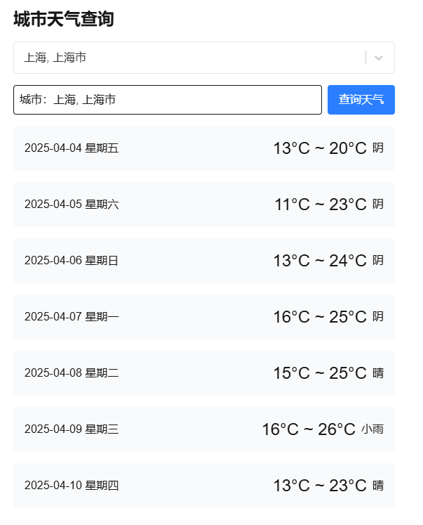

This is a [Next.js](https://nextjs.org) project bootstrapped with [`create-next-app`](https://nextjs.org/docs/app/api-reference/cli/create-next-app).

## Getting Started

First, run the development server:

```bash
npm run dev
# or
yarn dev
# or
pnpm dev
# or
bun dev
```

Open [http://localhost:3000](http://localhost:3000) with your browser to see the result.

You can start editing the page by modifying `app/page.tsx`. The page auto-updates as you edit the file.

This project uses [`next/font`](https://nextjs.org/docs/app/building-your-application/optimizing/fonts) to automatically optimize and load [Geist](https://vercel.com/font), a new font family for Vercel.

## 项目介绍

使用和风天气api接口查询天气

1. 默认显示上海，并查询未来七天天气和温度。
2. 城市选择框输入或者选择城市。输入时可以防抖查询相应城市的列表，并在下拉列表中显示，汉字和拼音都可。
3. 在下拉列表中显示后选择，将填入查询天气输入框，点击查询，在列表中显示未来7天天气和温度。


